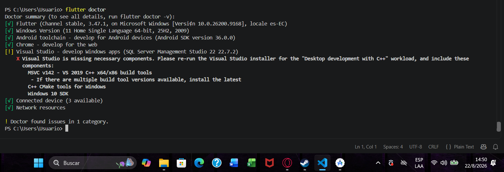
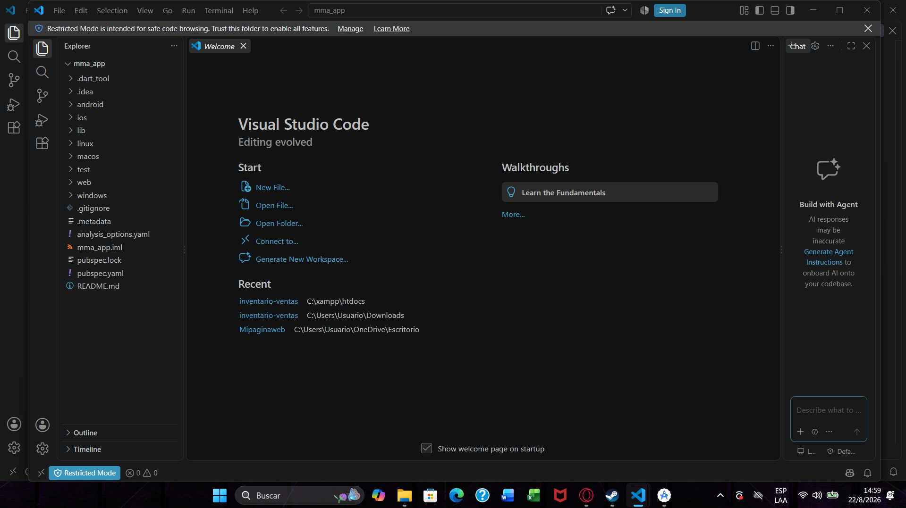
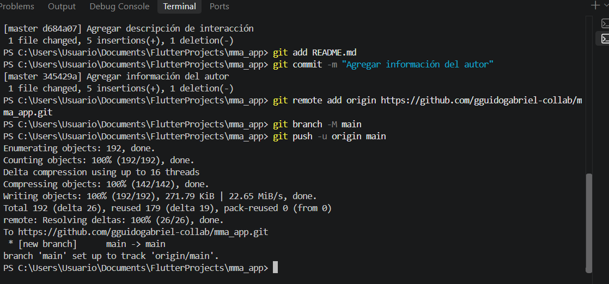
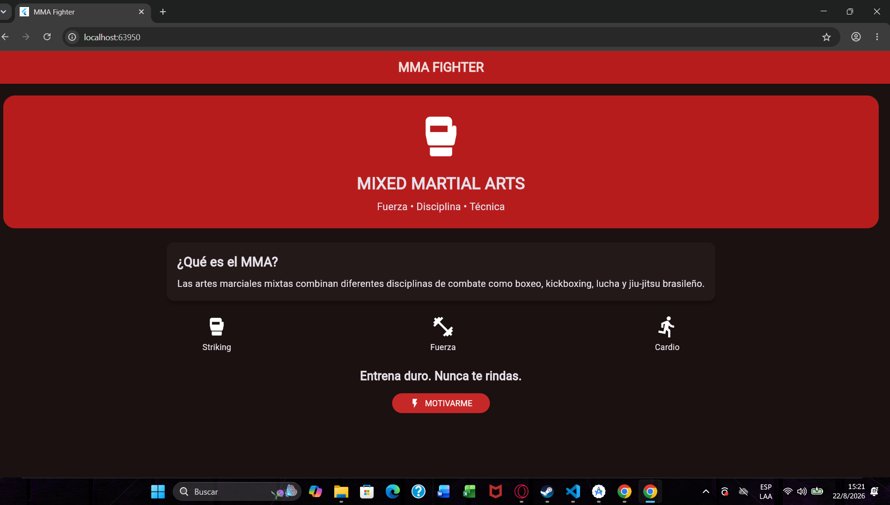
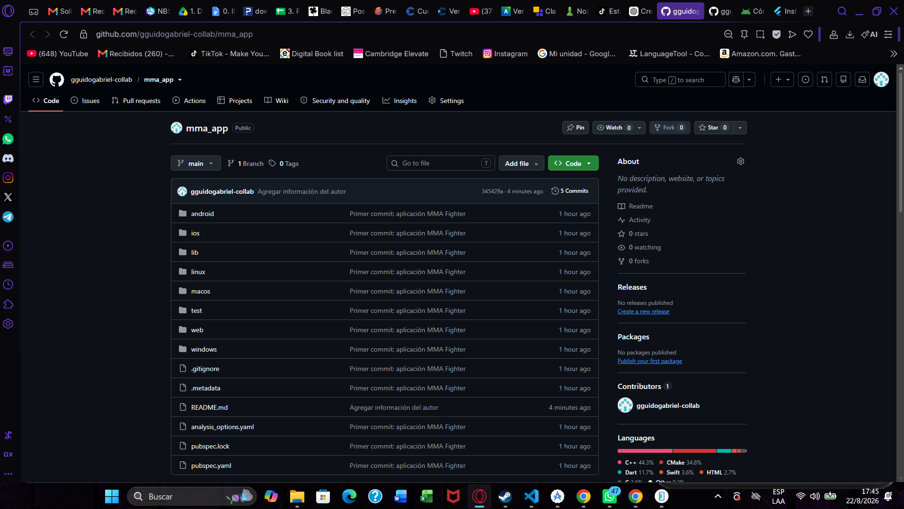
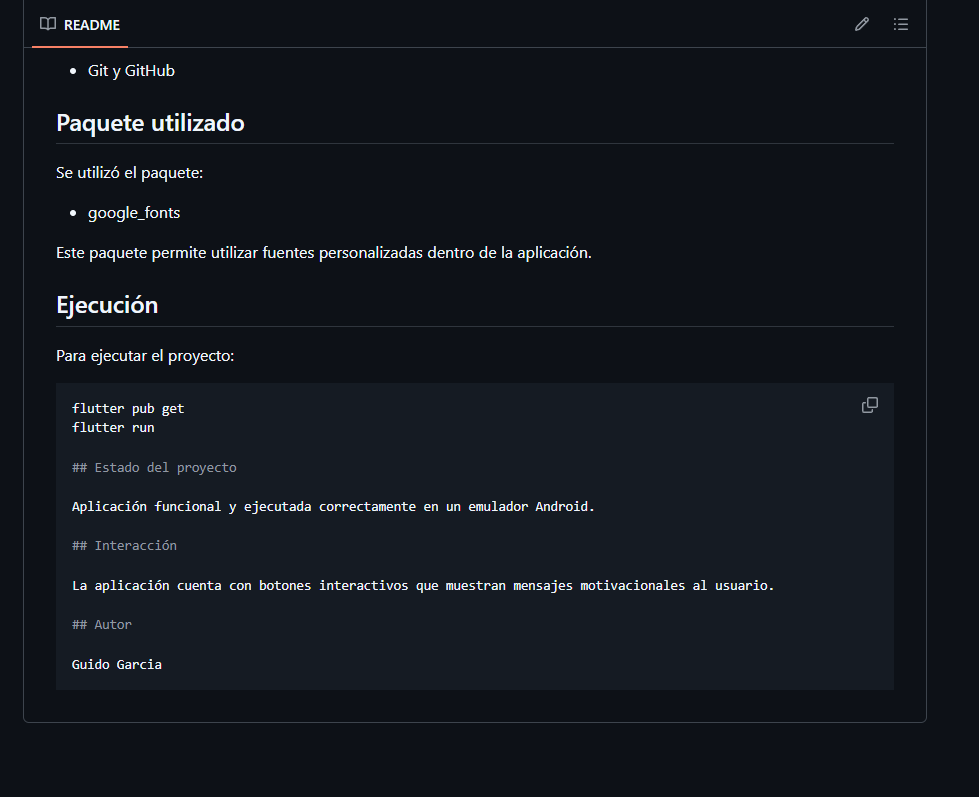
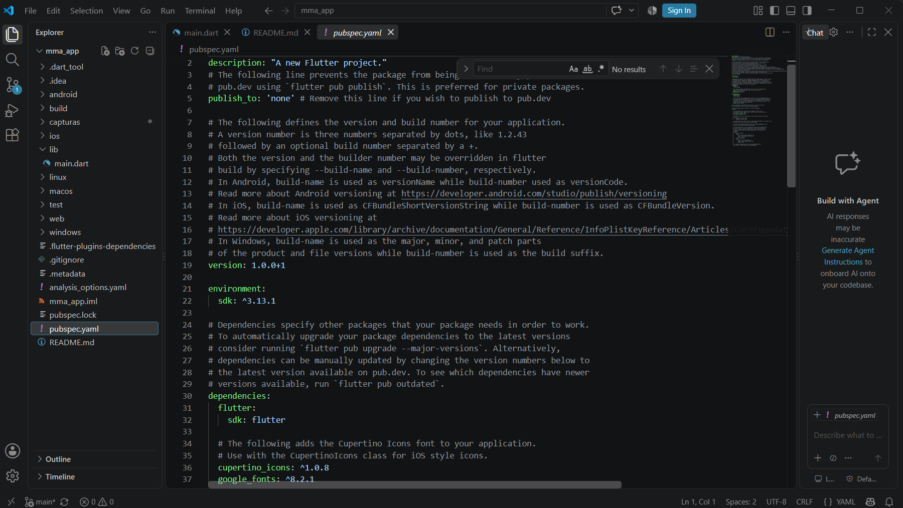
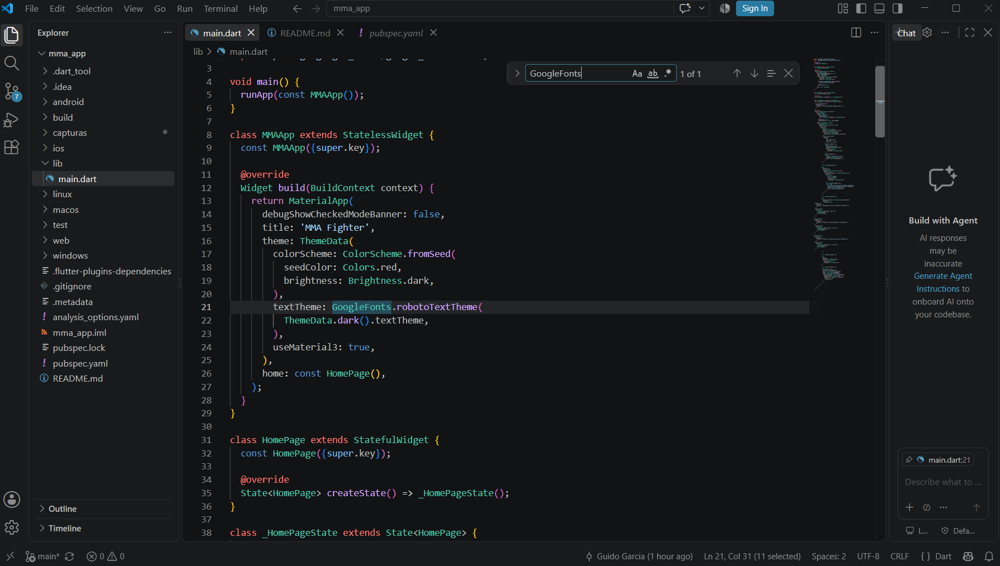
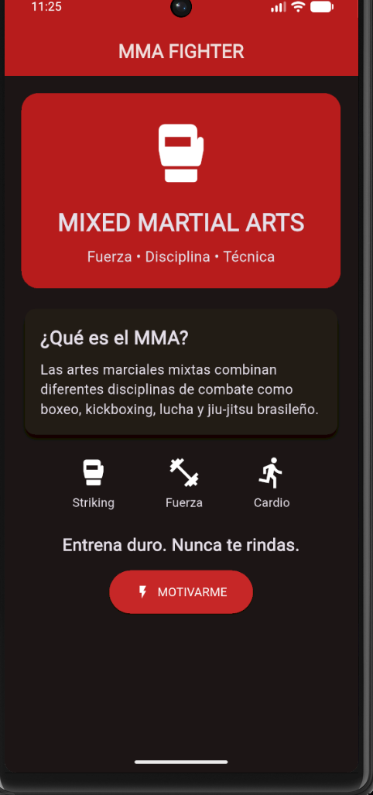
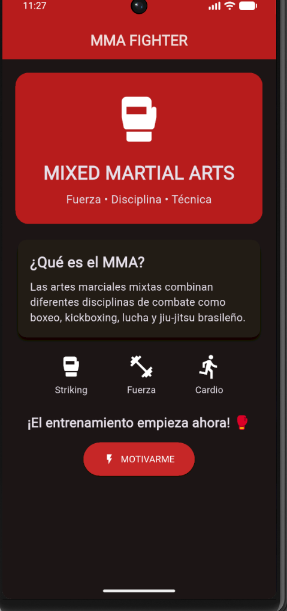

# MMA Fighter

Aplicación móvil desarrollada en Flutter sobre las Artes Marciales Mixtas (MMA).

## Descripción

MMA Fighter es una aplicación sencilla que presenta información básica sobre las Artes Marciales Mixtas, incluyendo disciplinas como striking, fuerza y cardio.

La aplicación incluye una interfaz personalizada, botones interactivos e iconos relacionados con el deporte.

## Funcionalidades

- Información sobre qué es el MMA.
- Sección de striking, fuerza y cardio.
- Botón interactivo "Motivarme".
- Mensajes motivacionales.
- Interfaz con colores personalizados.
- Uso de iconos de Flutter.
- Tipografía personalizada mediante Google Fonts.

## Tecnologías utilizadas

- Flutter
- Dart
- Visual Studio Code
- Android Emulator
- Git y GitHub

## Paquete utilizado

Se utilizó el paquete:

- google_fonts

Este paquete permite utilizar fuentes personalizadas dentro de la aplicación.

## Ejecución

Para ejecutar el proyecto:

```bash
flutter pub get
flutter run

## Estado del proyecto

Aplicación funcional y ejecutada correctamente en un emulador Android.

## Interacción

La aplicación cuenta con botones interactivos que muestran mensajes motivacionales al usuario.

## Autor

Guido Garcia

# Actividad Integradora 2

## Descripción de la aplicación

MMA Fighter es una aplicación móvil desarrollada en Flutter enfocada en el mundo de las Artes Marciales Mixtas (MMA). La aplicación presenta información sobre diferentes disciplinas, rutinas de entrenamiento y favoritos, mediante una interfaz personalizada y navegación entre diferentes pantallas.

Para esta actividad se continuó mejorando la aplicación desarrollada en la Actividad Integradora 1, incorporando nuevas pantallas, navegación, widgets, interacciones, manejo de estado y personalización visual.

## Pantallas desarrolladas

La aplicación cuenta con cuatro pantallas principales:

1. **Inicio:** presenta la aplicación MMA Fighter, información general sobre MMA y acceso a las diferentes secciones.
2. **Disciplinas:** muestra las disciplinas relacionadas con MMA, como Striking, Brazilian Jiu-Jitsu, Wrestling y Muay Thai.
3. **Entrenamiento:** presenta una rutina de MMA con ejercicios de cardio, striking y fuerza, además de permitir agregar rondas y mostrar consejos.
4. **Favoritos:** permite visualizar y gestionar las disciplinas guardadas como favoritas.

## Widgets utilizados

Durante el desarrollo se incorporaron diferentes widgets de Flutter, entre ellos:

- ListView
- GridView
- Card
- CircleAvatar
- Divider
- Image
- Icon
- ElevatedButton
- IconButton
- Padding
- SizedBox
- Container

Estos widgets permiten organizar la información, crear tarjetas, botones, iconos, imágenes y mejorar la presentación visual de la aplicación.

## Interacciones implementadas

Se implementaron diferentes acciones dentro de la aplicación:

- Navegación entre las cuatro pantallas mediante Navigator.
- Agregar rondas de entrenamiento.
- Mostrar y ocultar consejos de entrenamiento.
- Agregar y eliminar disciplinas de favoritos.

## Uso de setState()

Se utilizó `setState()` para actualizar dinámicamente la información mostrada en pantalla.

En la pantalla de entrenamiento, `setState()` permite incrementar el número de rondas completadas y actualizar el contador inmediatamente en la interfaz.

También se utiliza para mostrar u ocultar información de acuerdo con la interacción del usuario.

## Paquete externo utilizado

Se utilizó el paquete:

**flutter_launcher_icons**

Este paquete permite generar y configurar automáticamente los íconos de lanzamiento de la aplicación para Android utilizando una imagen personalizada.

## Personalización de la aplicación

Se realizaron diferentes modificaciones para personalizar la aplicación:

- **Nombre:** MMA Fighter.
- **Ícono:** se incorporó un ícono personalizado relacionado con MMA.
- **Logotipo:** se agregó una imagen representativa de MMA Fighter.
- **Colores:** se utilizó una combinación de colores oscuros con tonos rojizos, acorde con la temática deportiva y de combate.

## Evidencias

La aplicación fue ejecutada correctamente en un emulador Android, verificando el funcionamiento de las pantallas, navegación e interacciones implementadas.

### Capturas de evidencia





















## Ejecución del proyecto

Para ejecutar el proyecto se debe tener Flutter instalado y un dispositivo o emulador Android disponible.

Ejecutar los siguientes comandos desde la carpeta del proyecto:

```bash
flutter pub get
flutter run