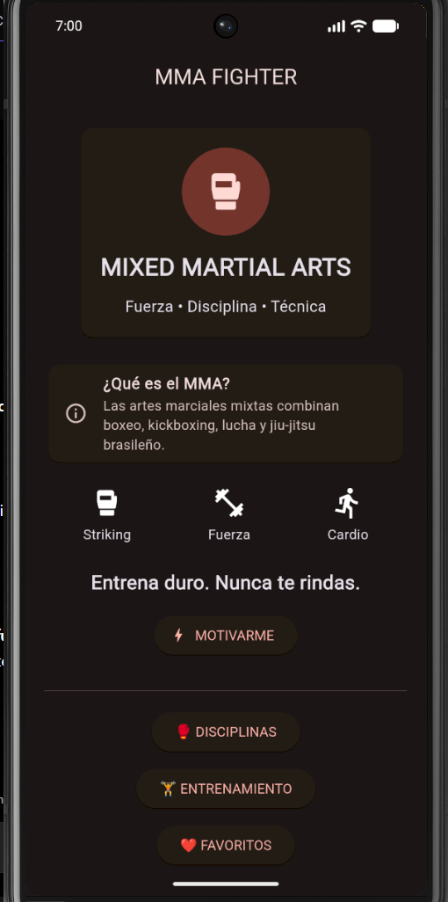
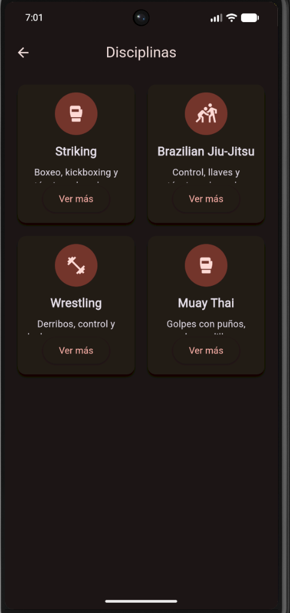
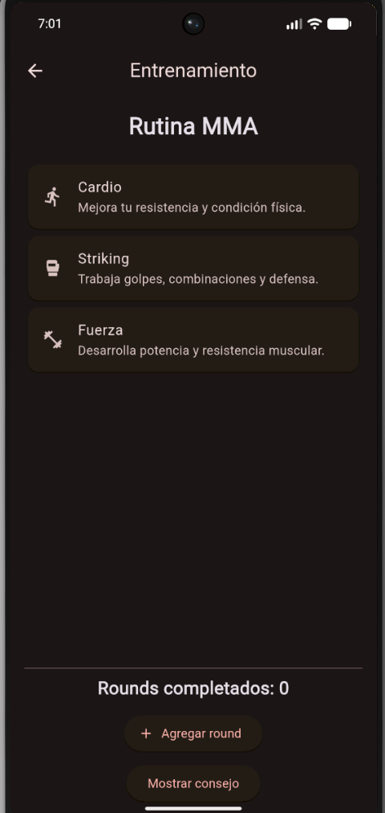
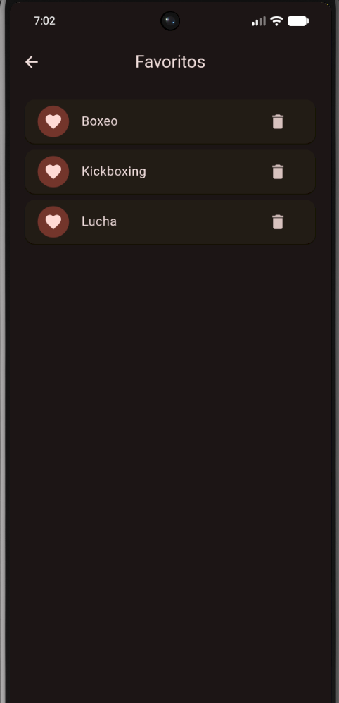
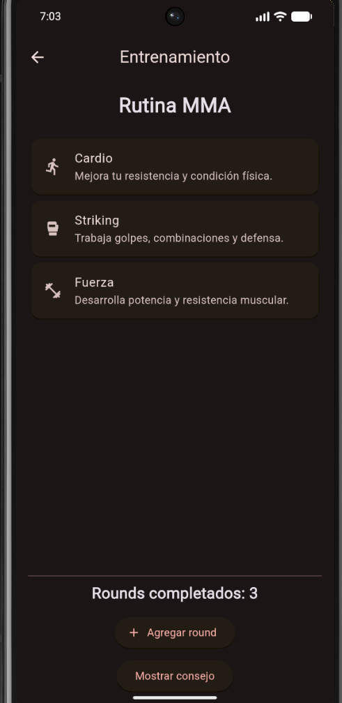

# MMA Fighter

Aplicación móvil desarrollada en Flutter sobre las Artes Marciales Mixtas (MMA), creada como proyecto académico para demostrar el uso de navegación entre pantallas, manejo de estado con Provider y componentes reutilizables.

## Descripción

MMA Fighter es una aplicación móvil enfocada en el mundo de las Artes Marciales Mixtas. La aplicación presenta información sobre diferentes disciplinas, entrenamiento y favoritos mediante una interfaz personalizada y organizada.

El proyecto fue desarrollado utilizando Flutter y Dart, incorporando navegación entre cuatro pantallas, widgets reutilizables, un modelo de datos y manejo de estado mediante Provider.

## Objetivo

El objetivo del proyecto es desarrollar una aplicación Flutter funcional que permita aplicar conceptos de desarrollo de aplicaciones móviles, organización del código, navegación, manejo de estado y creación de componentes reutilizables.

## Funcionalidades

- Pantalla principal con información general sobre MMA.
- Sección de disciplinas de MMA.
- Disciplinas como Striking, Brazilian Jiu-Jitsu, Wrestling y Muay Thai.
- Pantalla de entrenamiento.
- Contador de rounds completados.
- Mostrar y ocultar consejos de entrenamiento.
- Sistema de favoritos.
- Agregar y eliminar disciplinas de favoritos.
- Navegación entre cuatro pantallas.
- Uso de imágenes, iconos, textos y botones.
- Listas dinámicas mediante `GridView.builder` y `ListView.builder`.
- Interfaz personalizada con temática deportiva.
- Tipografía personalizada mediante Google Fonts.

## Tecnologías utilizadas

- Flutter
- Dart
- Visual Studio Code
- Android Emulator
- Git
- GitHub

## Paquetes utilizados

### Provider

Se utilizó el paquete `provider` para implementar el manejo de estado de la aplicación.

Provider permite mantener y compartir el estado de los favoritos entre diferentes pantallas.

### Google Fonts

Se utilizó `google_fonts` para incorporar una tipografía personalizada en la aplicación.

### Flutter Launcher Icons

Se utilizó `flutter_launcher_icons` para configurar un ícono personalizado para la aplicación Android.

## Manejo de estado con Provider

El proyecto utiliza `Provider` para administrar el estado de las disciplinas favoritas.

Se creó la clase:

`FavoritesProvider`

Esta clase extiende `ChangeNotifier` y contiene la lista de favoritos.

Cuando el usuario agrega o elimina una disciplina de favoritos, se ejecuta:

`notifyListeners()`

Esto permite notificar a los widgets que utilizan el Provider para que actualicen automáticamente la información mostrada.

La aplicación utiliza:

- `ChangeNotifier`
- `ChangeNotifierProvider`
- `Consumer`
- `notifyListeners()`

De esta manera, una acción realizada en la pantalla de disciplinas se refleja en la pantalla de favoritos.

## Modelo de datos

Se creó el modelo:

`Discipline`

Este modelo representa una disciplina de MMA y contiene:

- Nombre.
- Descripción.
- Icono.

El modelo permite organizar la información de las disciplinas de forma estructurada.

## Widgets reutilizables

Se crearon componentes reutilizables en archivos independientes para evitar repetir código.

### DisciplineCard

Archivo:

`lib/widgets/discipline_card.dart`

Este widget representa cada disciplina de MMA mediante una tarjeta que muestra su nombre, descripción, icono y botón para agregar o eliminar la disciplina de favoritos.

### TrainingCard

Archivo:

`lib/widgets/training_card.dart`

Este widget representa cada elemento de la rutina de entrenamiento mediante una tarjeta reutilizable con icono, título y descripción.

## Estructura del proyecto

```text
mma_app/
│
├── assets/
│   ├── mma.jpg.jpeg
│   └── mma_icon.png
│
├── capturas/
│   ├── 01_flutter_doctor.png
│   ├── 02_proyecto_vscode.png
│   ├── 03_git_push_github.png
│   ├── 04_app_funcionando.png
│   ├── 05_github_repositorio.png
│   ├── 06_readme.png
│   ├── 07_pubspec_google_fonts.png.png
│   ├── 08_uso_google_fonts.png.png
│   ├── 09_aplicacion_emulador.png.png
│   ├── 10_boton_interactivo.png
│   ├── 11_pantalla_principal.png
│   ├── 12_pantalla_disciplinas.png
│   ├── 13_pantalla_entrenamiento.png
│   ├── 14_pantalla_favoritos.png
│   └── 15_interaccion_round.png
│
├── lib/
│   ├── models/
│   │   └── discipline.dart
│   │
│   ├── providers/
│   │   └── favorites_provider.dart
│   │
│   ├── screens/
│   │   ├── home_screen.dart
│   │   ├── disciplines_screen.dart
│   │   ├── training_screen.dart
│   │   └── favorites_screen.dart
│   │
│   ├── widgets/
│   │   ├── discipline_card.dart
│   │   └── training_card.dart
│   │
│   └── main.dart
│
├── pubspec.yaml
└── README.md
```

## Pantallas desarrolladas

La aplicación cuenta con cuatro pantallas principales:

### 1. Inicio

Presenta el nombre de la aplicación, una imagen relacionada con MMA, información general sobre las Artes Marciales Mixtas y accesos a las diferentes secciones.

### 2. Disciplinas

Muestra diferentes disciplinas relacionadas con MMA mediante tarjetas dinámicas:

- Striking
- Brazilian Jiu-Jitsu
- Wrestling
- Muay Thai

Cada tarjeta permite agregar o eliminar la disciplina de favoritos.

### 3. Entrenamiento

Presenta diferentes elementos de una rutina de entrenamiento:

- Cardio
- Striking
- Fuerza

Además, permite aumentar el número de rounds completados y mostrar u ocultar un consejo de entrenamiento.

### 4. Favoritos

Muestra las disciplinas que el usuario ha agregado como favoritas.

La información se actualiza dinámicamente mediante Provider.

## Navegación

La aplicación utiliza navegación entre las diferentes pantallas mediante `Navigator` y rutas definidas en `MaterialApp`.

Las principales rutas son:

- `/disciplines`
- `/training`
- `/favorites`

Esto permite al usuario desplazarse entre las cuatro secciones principales de la aplicación.

## Interacciones implementadas

Se implementaron diferentes acciones dentro de la aplicación:

- Navegación entre pantallas.
- Agregar rounds de entrenamiento.
- Mostrar y ocultar consejos.
- Agregar disciplinas a favoritos.
- Eliminar disciplinas de favoritos.
- Actualización automática de la pantalla de favoritos mediante Provider.
- Botones interactivos para acceder a las diferentes secciones.

## Uso de setState()

Se utiliza `setState()` en la pantalla de entrenamiento para actualizar información local de la interfaz.

Por ejemplo, permite incrementar el número de rounds completados y actualizar inmediatamente el contador mostrado al usuario.

También se utiliza para mostrar u ocultar el consejo de entrenamiento.

## Uso de Provider

El manejo de favoritos se realiza mediante Provider.

El flujo principal es:

```text
Usuario selecciona una disciplina
            ↓
FavoritesProvider
            ↓
toggleFavorite()
            ↓
notifyListeners()
            ↓
Consumer actualiza la interfaz
            ↓
Pantalla de Favoritos
```

Esto demuestra el uso de un estado compartido entre diferentes partes de la aplicación.

## Personalización de la aplicación

Se realizaron diferentes modificaciones para personalizar la aplicación:

- **Nombre:** MMA Fighter.
- **Ícono:** se incorporó un ícono personalizado relacionado con MMA.
- **Imagen:** se incorporó una imagen local relacionada con las Artes Marciales Mixtas.
- **Colores:** se utilizó una combinación de colores oscuros con tonos rojizos.
- **Tipografía:** se utilizó Google Fonts.
- **Interfaz:** se utilizaron tarjetas, botones, iconos y diferentes elementos de Material Design.

## Ejecución del proyecto

Para ejecutar el proyecto es necesario tener Flutter instalado y contar con un dispositivo físico o un emulador Android.

Desde la carpeta principal del proyecto ejecutar:

```bash
flutter pub get
flutter run
```

También es posible ejecutar el proyecto desde Visual Studio Code seleccionando un dispositivo o emulador Android disponible.

## Evidencias de la aplicación

### Pantalla principal



### Pantalla de disciplinas



### Pantalla de entrenamiento



### Pantalla de favoritos



### Interacción de entrenamiento



## Evidencia del uso de Provider

La pantalla de favoritos demuestra el funcionamiento del manejo de estado mediante Provider.

Al seleccionar una disciplina como favorita desde la pantalla de **Disciplinas**, esta se agrega al estado compartido y posteriormente aparece en la pantalla de **Favoritos**.


## Evidencias adicionales del desarrollo

### Flutter Doctor


### Proyecto en Visual Studio Code


### Git Push a GitHub


### Aplicación funcionando


### Repositorio en GitHub


### README


### Configuración de Google Fonts


### Uso de Google Fonts


### Aplicación en el emulador


### Botón interactivo


## Estado del proyecto

La aplicación se encuentra funcional y fue ejecutada correctamente en un emulador Android.

Se verificó el funcionamiento de:

- Navegación.
- Pantallas principales.
- Interacciones.
- Contador de rounds.
- Favoritos.
- Manejo de estado con Provider.
- Widgets reutilizables.
- Modelo de datos.
- Imágenes e iconos.

## Autor

**Guido Garcia**

Ingeniería en Sistemas Inteligentes

## Actividad Integradora 2

Proyecto desarrollado para demostrar la implementación de una aplicación Flutter con Provider, navegación, manejo de estado, modelo de datos y componentes reutilizables.